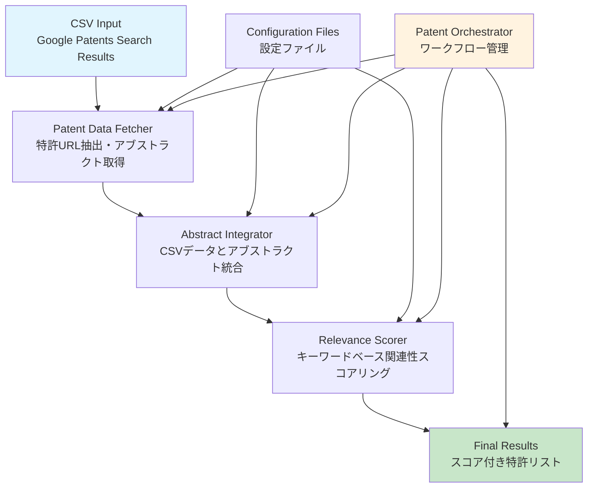

# PatentInsight Orchestrator

特許洞察オーケストレーター - Google Patentsの検索結果から関連性の高い特許文献を自動的に抽出し、詳細分析のための優先順位を付けるシステム

## 概要

PatentInsight Orchestratorは、Google Patentsの検索結果をCSV形式で受け取り、各特許のアブストラクトを自動取得し、設定可能なキーワードに基づく関連性スコアリングを行い、優先順位付けされた特許リストを生成します。

### 新機能（v1.1）
- **スコア順ソート機能**: 関連度スコア順（降順）でソートされたファイルを自動生成
- **バッチ処理機能**: 大量データの分割処理に対応
- **高速処理モード**: アブストラクト取得をスキップして高速処理
- **既存ファイルソート**: 既存のスコアリング結果ファイルからソート済みファイルを生成

## システム構成

### 動作関係図



### データフロー

```
CSV Input → Patent Data Fetcher → Abstract Integrator → Relevance Scorer → Final Results
     ↓              ↓                    ↓                    ↓              ↓
Raw Search    Patent URLs        Integrated Data      Scored Patents   Analysis Report
Results       + Abstracts        (CSV + JSON)         + Rankings       + Statistics
```

## コンポーネント

### 1. [Patent Data Fetcher](docs/specifications/patent_data_fetcher_spec.md)
- **役割**: Google Patentsから特許アブストラクトを取得
- **入力**: CSV形式の特許検索結果
- **出力**: JSON形式の特許データ（アブストラクト付き）

### 2. [Abstract Integrator](docs/specifications/abstract_integrator_spec.md)
- **役割**: CSV特許データとアブストラクトデータを統合
- **入力**: CSV特許データ + JSONアブストラクトデータ
- **出力**: 統合されたJSON形式データ

### 3. [Relevance Scorer](docs/specifications/relevance_scorer_spec.md)
- **役割**: キーワードベースの関連性スコアリング
- **入力**: 統合された特許データ + キーワード設定
- **出力**: スコアリング結果 + ランキング

### 4. [Patent Orchestrator](docs/specifications/patent_orchestrator_spec.md)
- **役割**: 全体ワークフローの管理と統合
- **入力**: 設定ファイル + 各コンポーネント
- **出力**: 実行結果サマリー + 最終結果

## ディレクトリ構成

```
patent_analyzer/
├── data/                       # データディレクトリ
│   ├── raw_search_results/     # 入力CSVファイル
│   ├── test_data/              # テストデータ
│   └── processed/              # 処理済みデータ
├── src/                        # Pythonソースコード
│   ├── patent_data_fetcher.py  # 特許データ抽出
│   ├── abstract_integrator.py  # アブストラクト統合
│   ├── relevance_scorer.py     # 関連性スコアリング
│   └── patent_orchestrator.py  # メイン実行スクリプト
├── config/                     # 設定ファイル
│   └── scoring_keywords.json   # キーワード・スコア設定
├── docs/                       # ドキュメント
│   └── specifications/         # 詳細仕様書
├── logs/                       # ログファイル
├── README.md                   # このファイル
└── requirements.txt            # 依存関係
```

## インストール

### 1. 依存関係のインストール

```bash
cd ~/GitHub/torir-util
pip install -r patent_analyzer/requirements.txt
```

### 2. 設定ファイルの準備

`patent_analyzer/config/scoring_keywords.json`を編集して、分析対象に適したキーワードを設定してください。

## 使用方法

### 基本的な使用

```bash
# テストデータを使用した実行例
python3 patent_analyzer/src/patent_orchestrator.py \
  --input patent_analyzer/data/test_data/sample_patents.csv

# 実際のデータを使用
python3 patent_analyzer/src/patent_orchestrator.py \
  --input patent_analyzer/data/raw_search_results/your_search_results.csv
```

### 新機能：スコア順ソート

```bash
# 既存のスコアリング結果ファイルからソート済みファイルを生成
python3 patent_analyzer/src/patent_orchestrator.py \
  --sort-scored-file patent_analyzer/data/processed/scored_patents_20250704_185141.json

# 出力: patent_analyzer/data/processed/scored_patents_20250704_185141_sorted.json
```

### バッチ処理（大量データ対応）

```bash
# 1番目から10件の特許のみ処理
python3 patent_analyzer/src/patent_orchestrator.py \
  --input patent_analyzer/data/raw_search_results/your_search_results.csv \
  --start_number 1 --batch_size 10

# 11番目から20件の特許のみ処理
python3 patent_analyzer/src/patent_orchestrator.py \
  --input patent_analyzer/data/raw_search_results/your_search_results.csv \
  --start_number 11 --batch_size 10
```

### 高速処理モード

```bash
# アブストラクト取得をスキップして高速処理
python3 patent_analyzer/src/patent_orchestrator.py \
  --input patent_analyzer/data/raw_search_results/your_search_results.csv \
  --skip_abstract_fetch
```

### 個別コンポーネントのテスト

```bash
# CSV to JSON Converterのテスト
python3 patent_analyzer/src/patent_orchestrator.py \
  --input patent_analyzer/data/test_data/sample_patents.csv \
  --test csv-converter

# Patent Data Fetcherのテスト（CSV to JSON converterを含む）
python3 patent_analyzer/src/patent_orchestrator.py \
  --input patent_analyzer/data/test_data/sample_patents.csv \
  --test data-fetcher

# Abstract Integratorのテスト
python3 patent_analyzer/src/patent_orchestrator.py \
  --input patent_analyzer/data/test_data/sample_patents.csv \
  --test abstract-integrator

# Relevance Scorerのテスト（Abstract Integratorを含む）
python3 patent_analyzer/src/patent_orchestrator.py \
  --input patent_analyzer/data/test_data/sample_patents.csv \
  --test relevance-scorer

# 全コンポーネントのテスト
python3 patent_analyzer/src/patent_orchestrator.py \
  --input patent_analyzer/data/test_data/sample_patents.csv \
  --test all
```

### jqベースのAbstract Integratorの使用

```bash
# 個別にAbstract Integratorを実行
python3 patent_analyzer/src/abstract_integrator.py \
  patent_analyzer/data/test_data/sample_patents.csv \
  patent_analyzer/data/test_data/sample_abstracts.json \
  output/integrated_patents.json

# jqコマンドを直接使用
cat patent_analyzer/data/test_data/sample_patents.csv | jq -R -s -c '
  split("\n") | .[1:-1] | map(split(",")) | map({
    "id": .[0],
    "title": .[1],
    "assignee": .[2],
    "inventors": .[3],
    "priority_date": .[4],
    "filing_date": .[5],
    "publication_date": .[6],
    "grant_date": .[7],
    "result_link": .[8]
  })
' > patents.json
```

### オプション付きの使用

```bash
# 上位20件を表示
python3 patent_analyzer/src/patent_orchestrator.py \
  --input patent_analyzer/data/raw_search_results/your_search_results.csv \
  --top-n 20

# 詳細ログ出力
python3 patent_analyzer/src/patent_orchestrator.py \
  --input patent_analyzer/data/raw_search_results/your_search_results.csv \
  --verbose
```

## 入力ファイル形式

Google Patentsの検索結果CSVファイルの期待される形式：

```csv
id,title,assignee,inventor/author,priority date,filing/creation date,publication date,grant date,result link
US-9254383-B2,Devices and methods for monitoring non-invasive vagus nerve stimulation,"ElectroCore, LLC","Bruce J. Simon, Joseph P. Errico",2009-03-20,2013-04-28,2016-02-09,2016-02-09,https://patents.google.com/patent/US9254383B2/en
```

## 出力ファイル

### 1. スコア付き特許データ
- **元の順序**: `patent_analyzer/data/processed/scored_patents_YYYYMMDD_HHMMSS.json`
- **スコア順ソート**: `patent_analyzer/data/processed/scored_patents_YYYYMMDD_HHMMSS_sorted.json`
- 形式: JSON配列（関連度スコア降順でソート、NaNスコアは除外）

### 2. 実行結果サマリー
- ファイル名: `patent_analyzer/data/processed/orchestrator_results_YYYYMMDD_HHMMSS.json`
- 形式: JSON（実行統計、エラー情報、上位特許リスト）

### 3. ログファイル
- 分析ログ: `patent_analyzer/logs/orchestrator_YYYY-MM-DD.log`
- 特許データ取得ログ: `patent_analyzer/logs/patent_data_fetcher_YYYY-MM-DD.log`

## 設定ファイル

### scoring_keywords.json

キーワードとスコアリングルールを定義するJSONファイル：

```json
{
  "categories": {
    "mental_health": {
      "keywords": ["mental health", "anxiety", "depression", "stress"],
      "weight": 1.0
    },
    "biosensor": {
      "keywords": ["biosensor", "wearable", "sensor", "monitoring"],
      "weight": 0.8
    }
  }
}
```

## エラーハンドリング

- **ネットワーク関連エラー**: 接続失敗、タイムアウト
- **アクセス制限関連エラー**: レート制限、CAPTCHA検出
- **データ関連エラー**: 形式不正、欠損データ
- **システム関連エラー**: メモリ不足、ディスク容量不足

## トラブルシューティング

### よくある問題

#### 1. CSVファイル読み込みエラー
- **原因**: ファイル形式不正、エンコーディングエラー
- **対処法**: UTF-8エンコーディングで保存、CSV形式確認

#### 2. アブストラクト取得失敗
- **原因**: ネットワーク問題、レート制限
- **対処法**: ネットワーク接続確認、リトライ間隔調整

#### 3. スコアリング結果が期待と異なる
- **原因**: キーワード設定の不適切
- **対処法**: `scoring_keywords.json`の見直し

## 開発者向け情報

### 個別コンポーネントのテスト

```bash
# PatentDataFetcherのテスト
python3 patent_analyzer/src/patent_data_fetcher.py --input test.csv

# AbstractIntegratorのテスト
python3 patent_analyzer/src/abstract_integrator.py patents.csv abstracts.json

# RelevanceScorerのテスト
python3 patent_analyzer/src/relevance_scorer.py integrated.json
```

### 詳細仕様書

- [システム概要仕様書](docs/specifications/system_overview.md)
- [Patent Data Fetcher 詳細仕様書](docs/specifications/patent_data_fetcher_spec.md)
- [Abstract Integrator 詳細仕様書](docs/specifications/abstract_integrator_spec.md)
- [Relevance Scorer 詳細仕様書](docs/specifications/relevance_scorer_spec.md)
- [Patent Orchestrator 詳細仕様書](docs/specifications/patent_orchestrator_spec.md)

## ライセンス

このツールは教育・研究目的で作成されています。商用利用の際は、Google Patentsの利用規約を確認してください。

## 更新履歴

- **2025-07-04**: 初版作成
  - PatentInsight Orchestratorシステム実装
  - 4つの主要コンポーネント実装
  - エラーハンドリングとログ機能
  - 設定可能なキーワードシステム 